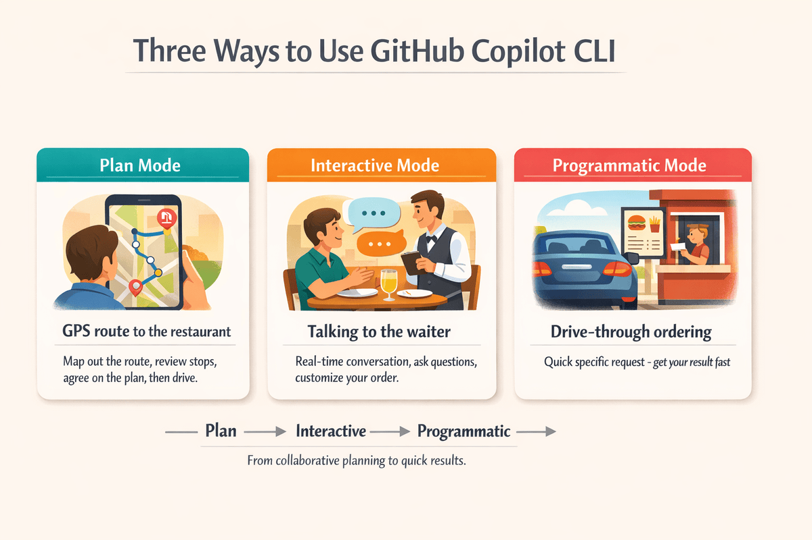

# 🎛️ 2: 3가지 모드와 기본 명령

> 🕒 실제 핸즈온 소요 시간: 약 15~20분

이 문서는 GitHub Copilot CLI를 빠르게 익히기 위한 핵심만 정리한 버전입니다. 무엇을 할 수 있는지 먼저 감을 잡고, 어떤 모드를 언제 써야 하는지 이해한 뒤, 가장 자주 쓰는 명령만 익히는 데 초점을 둡니다.

사전 준비: [1: 설치 및 인증](./01-setup.md)을 먼저 끝내고 Copilot CLI 설치와 인증을 완료해 두는 것이 좋습니다.

## 🎯 이 장에서 익힐 것

이 장을 마치면 다음을 할 수 있습니다.

- Copilot CLI 대화 세션 시작하기
- Interactive, Plan, Programmatic 모드 구분해서 사용하기
- 자주 쓰는 슬래시 명령 익히기
- 세션 안에서 빠르게 셸 명령 실행하기

## ▶️ 가장 먼저 해볼 것

Copilot CLI를 실행합니다.

```bash
copilot
```

처음에는 아래처럼 자연어로 가볍게 질문해 보면 충분합니다.

```text
> Python에서 dataclass가 무엇인지 쉽게 설명해줘
> 특정 키를 기준으로 딕셔너리 리스트를 정렬하는 함수를 작성해줘
> Python에서 리스트와 튜플의 차이점이 무엇인지 알려줘
```

```text
> Explain what a dataclass is in Python in simple terms
> Write a function that sorts a list of dictionaries by a specific key
> What's the difference between a list and a tuple in Python?
```

핵심은 간단합니다. Copilot CLI는 대화형 도구이므로 명령문을 억지로 외우기보다, 동료에게 묻듯이 자연스럽게 질문하고 이어서 보완하면 됩니다.

## 🧭 세 가지 모드


## 🧩 실생활 비유: 외식하기

GitHub Copilot CLI를 사용하는 과정을 외식에 비유해 보면 이해가 쉽습니다. 식당에 가기 전 동선을 정하는 것부터 주문하는 순간까지, 상황마다 어울리는 방식이 다릅니다.

| 모드 | 외식 비유 | 사용 시점 |
| ---- | --------- | --------- |
| **Plan** | 식당까지 가는 경로를 GPS로 미리 확인하기 | 복잡한 작업을 시작하기 전에 방향과 단계를 먼저 정리하고 싶을 때 |
| **Interactive** | 직원과 대화하며 주문하기 | 질문을 주고받고, 내용을 조정하고, 바로 피드백을 받으며 진행할 때 |
| **Programmatic** | 드라이브스루로 빠르게 주문하기 | 짧고 구체적인 요청을 빠르게 처리하고 바로 결과만 받고 싶을 때 |

외식할 때 상황에 따라 자연스럽게 방식을 고르듯, Copilot CLI도 작업 성격에 따라 어느 모드가 맞는지 점점 감이 잡히게 됩니다.



작업 성격에 맞춰 모드를 고르세요.  
- 먼저 방향을 잡고 싶다면 Plan, 
- 주고받으며 함께 풀고 싶다면 Interactive, 
- 한 번에 빠르게 결과를 받고 싶다면 Programmatic이 적합합니다.

### 🤔 어떤 모드부터 시작하면 될까?

**처음에는 Interactive 모드부터 시작하는 것이 좋습니다.**

- 여러 가지를 시험해 보고 후속 질문을 이어가기 쉽습니다
- 대화가 이어질수록 문맥이 자연스럽게 쌓입니다
- 잘못된 방향으로 갔더라도 `/clear` 로 쉽게 다시 시작할 수 있습니다

조금 익숙해진 뒤에는 아래처럼 넓혀 가면 됩니다.

- **Programmatic 모드** (`copilot -p "<your prompt>"`): 짧고 일회성인 질문을 빠르게 처리할 때
- **Plan 모드** (`/plan`): 코드를 바로 작성하기 전에 구현 방향을 더 자세히 정리하고 싶을 때

---

### 💬 1. Interactive 모드

탐색, 후속 질문, 여러 차례의 대화가 필요한 작업에 가장 적합합니다. 
우선, 터미널에서 GitHub Copilot CLI를 실행한 뒤, 다음 예시를 입력합니다.

```bash
copilot
```

예시:

[한글]
```text 한글
> @samples/book-app-project/books.py 파일이 하는 일을 간단하게 설명해 주세요
> @samples/book-app-project/book_app.py 파일의 코드 품질 문제를 검토해 주세요
> 동일한 파일의 모든 함수에 타입 힌트를 추가해 주세요
> /exit
```
[영문]
```text
> Explain what @samples/book-app-project/books.py does in simple terms
> Review @samples/book-app-project/book_app.py for code quality issues
> Add type hints to all functions in the same file
> /exit
```

**포인트**: 앞선 대화 맥락이 계속 유지되므로, 같은 작업을 조금씩 발전시키기에 가장 편합니다.

### 🗺️ 2. Plan 모드

바로 코드를 만들기 전에 접근 방법을 먼저 검토하고 싶은 작업에 적합합니다.
터미널에서 GitHub Copilot CLI를 실행한 뒤, 다음 예시를 입력합니다.

```bash
copilot
```

[한글]
```bash
> /plan "mark as read" 명령을 book 앱에 추가해 줘
```

[영문]
```bash
> /plan Add a "mark as read" command to the book app
```

처음부터 Plan 모드로 시작할 수도 있습니다.

```bash
copilot --plan
```

**포인트** : Copilot이 먼저 단계별 계획을 제시하므로, 구현 전에 방향을 점검하고 수정할 수 있습니다.

### ⚡ 3. Programmatic 모드

한 번에 답을 받고 끝내는 요청, 자동화, 스크립트 실행에 적합합니다.

[한글]
```bash
copilot -p "숫자가 짝수인지 홀수인지 확인하는 함수를 작성해 줘"
copilot -p "Python에서 JSON 파일을 읽는 방법을 알려줘"
```

[영문]
```bash
copilot -p "Write a function that checks if a number is even or odd"
copilot -p "How do I read a JSON file in Python?"
```

**포인트** : 빠르게 결과를 받고 종료하므로 반복 대화가 필요 없는 작업에 효율적입니다.

## 🧩 기억해야 할 /(슬래시) 명령

처음에는 아래 정도만 익혀도 충분합니다.

| 명령 | 용도 |
| ---- | ---- |
| `/ask` | 현재 대화 맥락에 영향을 덜 주는 일회성 질문 |
| `/clear` | 현재 대화 초기화 |
| `/help` | 사용 가능한 명령 확인 |
| `/model` | 현재 사용할 AI 모델 확인 또는 변경 |
| `/plan` | 구현 전에 계획 수립 |
| `/research` | GitHub 및 웹 기반 조사 실행 |
| `/exit` | 세션 종료 |

특히 `/ask` 는 현재 작업 흐름을 흐리지 않고 짧은 질문만 확인하고 싶을 때 유용합니다.

## 🖥️ `!` 프리픽스로 셸 명령 실행하기

Interactive 세션 안에서 `!` 로 시작하면 AI에 보내는 대신 셸 명령을 바로 실행할 수 있습니다.

```bash
copilot

> !git status
> !python -m pytest tests/
```

이 기능은 같은 세션 안에서 저장소 상태를 확인하거나, 테스트를 실행하거나, 간단한 터미널 명령을 빠르게 써야 할 때 유용합니다.

## 🤖 `/model` 로 모델 바꾸기

Copilot CLI에서 사용할 수 있는 모델은 요금제와 지역에 따라 다를 수 있습니다. `/model` 명령으로 현재 사용 가능한 모델을 확인하고, 세션에 쓸 모델을 바꿀 수 있습니다.

```bash
copilot
> /model
```

실전에서는 보통 아래처럼 생각하면 됩니다.

- 아직 익숙하지 않다면 `Auto` 를 선택해 자동으로 맡기기
- 일상적인 작업은 비용이 낮은 모델 위주로 사용하기
- 더 어려운 추론이나 큰 작업에만 비용이 높은 모델 쓰기(예, Claude Opus, Sonnet 등)

## 🌐 `/remote` 로 원격 세션 사용하기

Copilot CLI는 브라우저나 모바일 기기에서 원격으로 세션을 확인하고 제어할 수 있습니다.

터미널에서 원격 세션으로 시작하려면:

```bash
copilot --remote
```

이미 실행 중인 세션 안에서 원격 연결을 켜려면:

```text
> /remote
```

이후 링크와 QR 코드가 제공되며, 다른 기기에서 세션을 보면서 후속 질문을 보내거나 작업 흐름을 이어갈 수 있습니다.

## 🚀 가장 빠른 실습 루트

이 장에서 딱 세 가지만 해본다면 아래 순서가 좋습니다.

1. Interactive: `@samples/book-app-project/book_app.py` 파일을 리뷰해 달라고 요청하기
2. Plan: 검색 기능 추가 계획을 `/plan` 으로 세워보기
3. Programmatic: `copilot --allow-all -p` 로 파일 함수 설명을 한 번에 받아 보기

이 세 가지를 해보면 Copilot CLI의 대표적인 사용 패턴을 거의 다 경험할 수 있습니다.

## ⚠️ 자주 하는 실수

- `exit` 와 `/exit` 는 다르며, 슬래시 명령은 반드시 `/` 로 시작해야 합니다
- `-p` 모드는 이전 대화를 기억하지 않으므로, 여러 차례 이어지는 작업에는 맞지 않습니다
- 셸에서 특별하게 해석될 수 있는 문자가 들어간 프롬프트는 따옴표로 감싸는 것이 안전합니다

## 🔧 문제 해결 팁

- 원하는 모델이 보이지 않으면 `/model` 로 사용 가능 목록을 확인합니다
- 대화 맥락이 너무 길어지면 `/clear` 로 초기화하거나 새 세션을 시작합니다
- 사용량 제한에 걸리면 잠시 기다렸다가 다시 시도하거나 한 번에 처리하는 양을 줄입니다

## 🔑 핵심 정리

- 처음에는 Interactive 모드부터 쓰는 것이 가장 좋습니다.
- Plan 모드는 구현 전에 방향을 검토하고 싶을 때 적합합니다.
- Programmatic 모드는 스크립트나 단발성 요청에 잘 맞습니다.
- 가장 자주 쓰는 명령은 `/help`, `/clear`, `/plan`, `/model`, `/research`, `/exit` 입니다.

다음 단계: Chapter 02로 넘어가 `@` 참조와 세션 관리로 Copilot CLI에 더 정확한 문맥을 주는 방법을 익히면 됩니다.

**[다음으로 이동하기 →](./03-context.md)**
