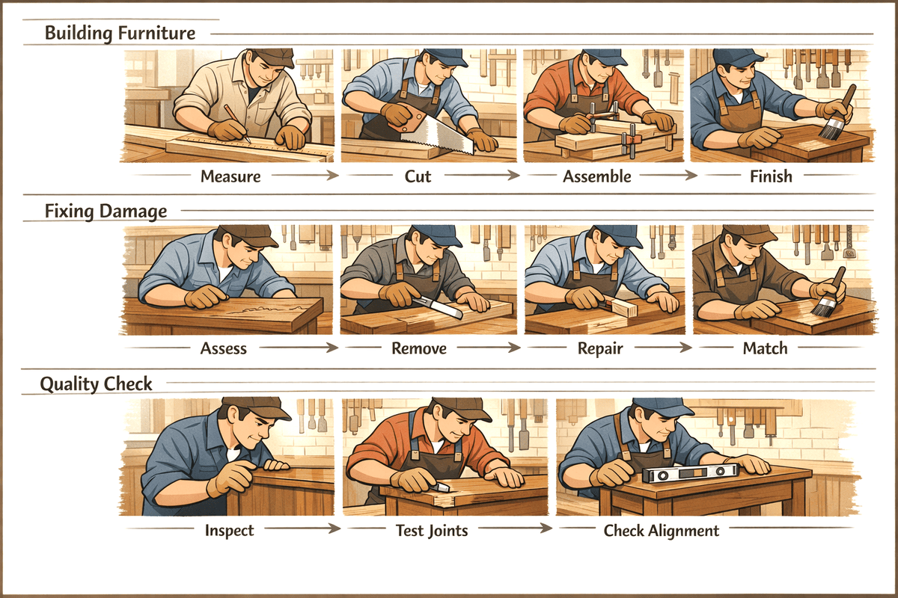

# 🛠️ 4: 개발 워크플로우

> 🕒 실제 핸즈온 소요 시간: 약 35~45분

이 장은 GitHub Copilot CLI를 단순한 질의응답 도구가 아니라, 실제 개발 흐름 속에서 매일 쓰는 도구로 활용하는 방법을 다룹니다. 핵심은 다섯 가지 워크플로입니다.

- [1. 코드 리뷰 ](#1-코드-리뷰-워크플로)
- [2. 리팩터링 ](#2-리팩터링-워크플로)
- [3. 디버깅 ](#3-디버깅-워크플로)
- [4. 테스트 생성 ](#4-테스트-생성-워크플로)
- [5. Git 통합 ](#5-git-통합-워크플로)

- [종합 실습: 1~5 워크플로를 한 번에 따라하기](#종합-실습-15-워크플로를-한-번에-따라하기)

## 🎯 이 장에서 익힐 것

이 장을 마치면 다음을 할 수 있습니다.

- Copilot CLI로 코드 리뷰를 더 구체적으로 수행하기
- 기존 코드를 더 안전하게 리팩터링하기
- 증상 중심으로 버그를 추적하고 수정하기
- 테스트를 자동 생성하고 실행 명령까지 확인하기
- Git 변경사항, 커밋 메시지, PR 흐름과 Copilot CLI를 연결하기

## 🪚 핵심 비유: 목수의 작업 흐름



목수는 망치만 잘 쓰는 것이 아니라, 상황마다 다른 작업 순서를 알고 있습니다. 개발도 같습니다. Copilot CLI의 진짜 가치는 "도구 하나"가 아니라, 작업 종류에 맞는 "반복 가능한 워크플로"를 강화한다는 점에 있습니다.

## 다섯 가지 워크플로


| 워크플로 | 언제 쓰면 좋은가 | 핵심 명령/패턴 |
| ---- | ---- | ---- |
| 코드 리뷰 | 병합 전 점검, 위험 요소 찾기 | `@file`, `@folder/`, `/review` |
| 리팩터링 | 구조 개선, 중복 제거, 역할 분리 | `@file` + 구체적 변경 요청 |
| 디버깅 | 버그 원인 추적, 데이터 흐름 분석 | 증상 설명 + `@file` |
| 테스트 생성 | pytest/Jest 테스트 초안 만들기 | `Generate tests for...` |
| Git 통합 | 커밋 메시지, PR 설명, 세션 diff 확인 | `copilot -p`, `/pr`, `/diff`, `/delegate` |

아래에서는 각 워크플로를 짧게 정리합니다.

## 1. 코드 리뷰 워크플로

코드 리뷰에서 가장 중요한 점은 "무엇을 볼지 구체적으로 말하는 것"입니다. 그냥 `코드를 리뷰해 줘` 보다, 어떤 범주를 집중해서 봐야 하는지 함께 주는 편이 결과가 훨씬 좋습니다.


### 기본 리뷰

```text
copilot

> @samples/book-app-project/book_app.py 코드 품질 측면에서 문제점이 있는지 리뷰해 주세요
```

### 입력 검증 중심 리뷰

```text
copilot

> @samples/book-app-project/utils.py 입력 유효성 검사 관련하여 문제점이 있는지 확인해 주세요. 특히, 누락된 유효성 검사, 오류 처리 누락, 경계 조건 처리 등을 점검해 주세요
```

### 프로젝트 전체 리뷰

```text
copilot

> @samples/book-app-project/ 프로젝트 전체를 리뷰해 주세요. 발견된 문제를 심각도별로 분류하고 마크다운 체크리스트를 만들어 주세요
```

### `/review` 사용하기

`/review`는 일반 프롬프트보다 코드 리뷰에 특화된 내장 에이전트를 호출합니다. 특히 Git 변경사항이 있을 때 유용합니다.

```text
copilot

> /review
> /review 인증에서 보안 문제가 있는지 확인해 주세요
```

### 리뷰 워크플로 핵심

- 파일 하나 리뷰보다, 의도와 범주를 함께 주는 것이 좋습니다
- 폴더 전체 리뷰는 체크리스트 형식으로 받으면 후속 작업이 쉽습니다
- Git 변경분이 있다면 `/review` 를 우선 고려하는 편이 좋습니다

## 2. 리팩터링 워크플로

리팩터링은 "코드를 더 좋게 바꾸되, 겉으로 보이는 동작은 유지하는 작업"입니다. Copilot CLI에게는 무엇을 바꾸고 무엇은 유지해야 하는지 분명히 말하는 것이 중요합니다.


### 간단한 리팩터링 예시

```text
copilot

> @samples/book-app-project/book_app.py 명령 처리에는 if/elif 체인을 사용합니다. 딕셔너리 디스패치 패턴을 사용하여 리팩터링합니다.
> @samples/book-app-project/utils.py 모든 함수에 타입 힌트를 추가합니다.
> @samples/book-app-project/book_app.py 책 표시 로직을 utils.py로 추출하여 관심사의 분리를 개선합니다.
```

### 여러 파일을 함께 리팩터링하기

```text
copilot

> @samples/book-app-project/utils.py @samples/book-app-project/book_app.py
> utils.py 파일은 논리가 뒤섞인 print 구문이 있습니다. 디스플레이 기능과 데이터 처리를 분리하도록 리팩토링을 합니다.
```

### 테스트를 먼저 생성한 뒤 리팩터링하기

```text
copilot

> @samples/book-app-project/books.py 리팩터링 전에 현재 동작에 대한 테스트를 생성해 주세요.
> BookCollection 클래스를 리팩터링하여 파일 작업에 컨텍스트 매니저를 사용하도록 변경합니다.
```

### 리팩터링 워크플로 핵심

- 작은 변경부터 시작하는 편이 안전합니다
- 여러 파일이 얽혀 있으면 함께 참조해야 정확도가 올라갑니다
- 테스트를 먼저 만들면 리팩터링 후 동작 보존을 검증하기 쉽습니다

## 3. 디버깅 워크플로

디버깅에서는 "버그를 찾아줘" 보다, "어떤 증상이 나타나는지"를 설명하는 편이 훨씬 강력합니다. Copilot CLI는 증상과 기대 동작을 비교해 원인을 추적합니다.


### 증상 중심 디버깅

```text
copilot

> @samples/book-app-buggy/books_buggy.py 사용자가 "The Hobbit"을 검색하면 데이터에 있음에도 결과가 나타나지 않는다고 보고합니다. 원인을 디버그해주세요.
```

### 에러 메시지와 함께 설명 요청하기

```text
copilot

> 이런 에러가 나타나고 있습니다:
> AttributeError: 'NoneType' object has no attribute 'title'
    at show_books (book_app.py:19)

> @samples/book-app-project/book_app.py 원인이 무엇이고 어떻게 해결하나요?
```

### 여러 파일을 따라가며 원인 찾기

```text
copilot

> 사용자들이 책 목록의 번호가 1이 아닌 0부터 시작한다고 합니다.
> @samples/book-app-buggy/book_app_buggy.py @samples/book-app-buggy/books_buggy.py
> 목록 표시 흐름을 따라가며 문제가 발생하는 곳을 파악해주세요
```

### 보안 점검에도 응용 가능

```text
copilot

> @samples/buggy-code/python/user_service.py 이 파이썬 user 서비스에서 모든 보안 취약점을 찾아 주세요
```

### 디버깅 워크플로 핵심

- 증상과 기대 동작을 함께 말할수록 좋습니다
- 스택 트레이스와 관련 파일을 같이 주면 훨씬 빠릅니다
- 한 버그를 찾는 과정에서 주변의 연관 버그도 함께 발견할 수 있습니다

## 4. 테스트 생성 워크플로

테스트 생성은 Copilot CLI가 특히 강한 영역입니다. 단순 happy path 테스트 몇 개가 아니라, edge case 까지 포함한 테스트 묶음을 빠르게 만들 수 있습니다.


### 프로젝트 함수 테스트 생성

```text
copilot

> @samples/book-app-project/books.py 종합적인 pytest 테스트들을 생성합니다.다음의 테스트들을 포함합니다:
 - Adding books
 - Removing books
 - Finding by title
 - Finding by author
 - Marking as read
 - Edge cases with empty data
```

### 특정 함수만 집중 테스트

```text
copilot

> @samples/book-app-project/utils.py get_book_details에 대한 포괄적인 pytest 테스트를 생성합니다:
 - Valid input
 - Empty strings
 - Invalid year formats
 - Very long titles
 - Special characters in author names
```

### 테스트 실행 명령 물어보기

```text
copilot

> How do I run the tests? Show me the pytest command.
```

### 테스트 워크플로 핵심

- 테스트 프레임워크를 명시하는 것이 좋습니다
- edge case 와 오류 시나리오를 직접 나열하면 품질이 올라갑니다
- 기존 테스트 파일에 "추가 테스트만" 요청하는 방식도 잘 작동합니다

## 5. Git 통합 워크플로

Copilot CLI는 코드 작성뿐 아니라, Git 기반 협업 흐름도 자동화해 줍니다.


### 커밋 메시지 생성

```text
git diff --staged
copilot -p "Generate a conventional commit message for: $(git diff --staged)"
```

### 마지막 커밋 설명 받기

```text
copilot -p "Explain what this commit does: $(git show HEAD --stat)"
```

### PR 설명 생성

```text
copilot -p "Generate a pull request description for these changes:
$(git log main..HEAD --oneline)

Include:
- Summary of changes
- Why these changes were made
- Testing done
- Breaking changes? (yes/no)"
```

### 인터랙티브 모드 명령

```text
copilot

> /pr [view|create|fix|auto]
> /diff
> /delegate Add input validation to the login form
```

### Git 워크플로 핵심

- 변경분이 staging 되어 있어야 커밋 메시지 품질이 좋아집니다
- `/diff` 는 현재 세션 변경사항을 커밋 전에 확인할 때 유용합니다
- `/delegate` 는 백그라운드로 넘기기 좋은, 경계가 명확한 작업에 적합합니다

## 종합 실습: 1~5 워크플로를 한 번에 따라하기

이 다섯 워크플로는 실제로는 따로 놀지 않습니다. 보통은 `리뷰 -> 리팩터링 -> 디버깅 -> 테스트 -> Git 정리` 순서로 이어지므로, 각각 분리해서 연습하는 것보다 하나의 흐름으로 묶어 연습하는 편이 더 실전적입니다.

아래 실습은 `samples/book-app-project` 를 기준으로, 하나의 기능 개선 시나리오를 끝까지 따라가는 방식입니다.

### 🎯 실습 목표

`find_by_author()` 또는 비슷한 검색 관련 로직을 기준으로, 리뷰부터 커밋 메시지 생성까지 한 흐름으로 경험합니다.

### 🔍 Step 1. 코드 리뷰로 문제 찾기

먼저 현재 구현의 문제점과 edge case 를 파악합니다.

```text
copilot

> @samples/book-app-project/books.py find_by_author 함수와 관련 검색 로직을 리뷰해 주세요. 특히 부분 일치 검색, 대소문자 처리, 입력 검증, 에러 처리 관점에서 어떤 문제가 있을 수 있는지 정리해 주세요.
```

이 단계의 목표는 바로 고치는 것이 아니라, 어떤 문제가 있는지 우선 목록으로 만드는 것입니다.

### ♻️ Step 2. 리팩터링으로 구조 개선하기

리뷰에서 나온 문제를 바탕으로, 동작을 깨지 않으면서 코드를 개선합니다.

```text
> 방금 리뷰 결과를 바탕으로 find_by_author 관련 로직을 리팩터링해 주세요. 특히 부분 일치 검색과 대소문자 무시를 지원하되, 외부 동작은 가능한 한 자연스럽게 유지해 주세요. 변경 전/후 핵심 차이도 함께 설명해 주세요.
```

이 단계에서는 무엇을 개선할지뿐 아니라 무엇은 유지해야 하는지도 함께 말하는 것이 중요합니다.

### 🐞 Step 3. 디버깅 관점으로 다시 검증하기

이제 사용자 증상 형태로 다시 질문해서, 수정이 정말 문제를 해결하는지 확인합니다.

```text
> 사용자가 "Tolkien" 으로 검색했는데 "J.R.R. Tolkien" 책이 나오지 않는다고 보고했다고 가정해 봅시다.현재 로직에서 왜 그런 문제가 생길 수 있었는지, 그리고 지금 수정안이 그 문제를 어떻게 해결하는지 설명해 주세요.
```

이 단계는 단순 수정이 아니라, 왜 이 수정이 맞는지 검증하는 단계입니다.

### 🧪 Step 4. 테스트 생성하기

이제 수정 사항을 검증할 pytest 테스트를 생성합니다.

```text
> @samples/book-app-project/books.py 방금 개선한 검색 로직에 대해 pytest 테스트를 생성해 주세요. 아래 시나리오를 포함해 주세요.
 - 전체 저자명 일치
 - 부분 저자명 일치
 - 대,
 소문자 무시
 - 빈 문자열 입력
 - 결과가 없는 경우
```

원한다면 이어서 이렇게 물어볼 수도 있습니다。

```text
> 이 테스트를 실행하려면 어떤 명령을 쓰면 되나요?
```

### 🌿 Step 5. 변경사항 리뷰 후 Git 정리하기

이제 세션 안에서 바뀐 내용을 다시 확인하고, Git 흐름으로 넘깁니다.

```text
> /diff
> /review
```

그다음 터미널에서 변경사항을 stage 합니다.

```text
git add .
```

마지막으로 커밋 메시지와 PR 설명까지 이어갈 수 있습니다.

```text
> Generate a conventional commit message for: $(git diff --staged)
> Generate a pull request description for these changes:
$(git log main..HEAD --oneline)

Include:
- Summary of changes
- Why these changes were made
- Testing done
- Breaking changes? (yes/no)"
```

### ✅ 실습이 끝나면 확인할 것

- 리뷰 단계에서 문제를 구체적으로 좁혔는지
- 리팩터링 요청에 유지해야 할 동작을 함께 명시했는지
- 디버깅 단계에서 증상과 원인을 연결해 설명할 수 있는지
- 테스트가 happy path 뿐 아니라 edge case 도 포함하는지
- Git 단계에서 `/diff`, `/review`, commit message 생성까지 자연스럽게 이어지는지

## ⚠️ 자주 하는 실수

- 너무 모호하게 프롬프트를 써서 일반론적인 답만 받기
- 코드 리뷰에서 `/review` 를 쓰지 않고 일반 질문만 하기
- 버그 증상을 설명하지 않고 그냥 "버그 찾아줘" 라고 하기
- 테스트 생성 시 pytest/Jest 같은 프레임워크를 명시하지 않기
- 리팩터링하면서 기존 동작 유지 조건을 말하지 않기

## 🔧 문제 해결 팁

- 리뷰가 얕으면 범위를 좁히고 검사 항목을 명시합니다
- 테스트 형식이 다르면 원하는 프레임워크를 직접 지정합니다
- 리팩터링 시 `IMPORTANT: Maintain identical external behavior` 같은 문구를 넣으면 도움이 됩니다
- Git 기반 프롬프트는 `git diff --staged`, `git show`, `git log main..HEAD` 같은 명령과 결합할 때 효과가 좋습니다

**[다음으로 이동하기 →](./05-agents.md)**
