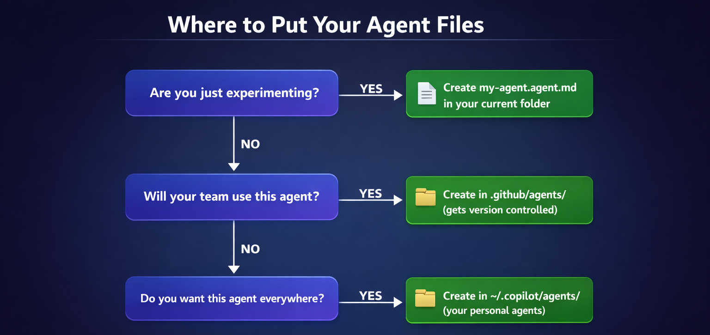

# 4: 에이전트와 커스텀 지침

이번 실습의 포인트는 두 가지입니다. 하나는 작업에 맞는 에이전트를 사용해서 Copilot CLI를 더 전문적으로 쓰는 법이고, 다른 하나는 프로젝트 규칙을 지침 파일로 고정해 일관된 결과를 얻는 법입니다.

## 이 장에서 익힐 것

이 장을 마치면 다음을 할 수 있습니다.

- 내장 에이전트인 `/plan`, `/review`의 역할 이해하기
- `.agent.md` 파일로 커스텀 에이전트 만들기
- `/agent` 와 `--agent` 로 에이전트 전환하기
- 프로젝트 규칙을 `AGENTS.md` 또는 `.instructions.md`에 넣어 자동 적용하기
- 한 작업에 여러 에이전트를 조합해 쓰기

## 핵심 개념: 일반 도우미보다 전문가

에이전트는 그냥 프롬프트를 길게 쓰는 기능이 아닙니다. 특정 역할과 기준이 미리 정해진 전문가를 불러오는 방식에 가깝습니다. 예를 들어 Python 리뷰어 에이전트는 타입 힌트, PEP 8, 에러 처리, 문서화 같은 기준을 기본값으로 가지고 답합니다.

| 상황 | 일반 Copilot | 에이전트 사용 |
| ---- | ---- | ---- |
| 코드 리뷰 | 넓고 일반적인 피드백 | 언어와 역할에 맞는 집중 피드백 |
| 테스트 작성 | 기본 테스트 제안 | 프레임워크와 예외 케이스까지 고려 |
| 문서화 | 설명 중심 | 팀 규칙과 형식을 반영한 문서 생성 |

집 수리를 맡길 때도 한 명의 만능 도우미보다, 배관공·전기기사·지붕 전문가처럼 문제별 전문가를 부르는 편이 정확합니다. 에이전트도 같은 원리입니다. 범용 AI 하나에 모든 걸 맡기기보다, 코드 리뷰, 테스트, 보안, 문서화처럼 목적이 분명한 에이전트를 쓰면 더 일관되고 실무적인 결과를 얻기 쉽습니다.

| 문제 | 전문가 | 이유 |
| ---- | ---- | ---- |
| 물이 샌다 | 배관공 | 배관 규칙과 전용 도구를 잘 앎 |
| 배선을 다시 한다 | 전기기사 | 안전 기준과 시공 규칙을 이해함 |
| 지붕을 교체한다 | 지붕 전문가 | 재료와 환경 조건을 고려할 수 있음 |

즉, 에이전트는 한 번 역할과 기준을 정해 두고 반복해서 불러 쓰는 전문가 세트라고 보면 됩니다.


## 먼저 알아둘 내장 에이전트

이전 실습에서 이미 일부 내장 에이전트를 사용했습니다. 이름을 몰랐을 뿐입니다.

| 에이전트 | 호출 방법 | 용도 |
| ---- | ---- | ---- |
| Plan | `/plan` | 구현 전에 단계별 계획 수립 |
| Code-review | `/review` | 변경 사항 검토 |
| Init | `/init` | 프로젝트용 설정 파일 생성 |
| Explore | 자동 | 코드베이스 탐색, 구조 분석 |
| Task | 자동 | 테스트, 빌드, 린트, 설치 등 실행 |

예시는 아래 정도만 기억하면 충분합니다.

<!-- markdownlint-disable MD033 -->
<pre><code>copilot

&gt; <span style="color: blue;">/plan</span> book 앱에 연도(year)에 대한 입력 유효성 검사를 추가합니다
&gt; <span style="color: blue;">/review</span>
&gt; 테스트 스위트를 실행합니다
&gt; 책 데이터가 어떻게 로드되는지 탐색합니다
</code></pre>
<!-- markdownlint-enable MD033 -->

핵심은 명확합니다. 계획이 필요하면 `/plan`, 변경 검토가 필요하면 `/review`, 프로젝트 초기 설정이 필요하면 `/init`을 떠올리면 됩니다. 나머지 두 개는 작업 성격에 따라 자동으로 동작합니다。

## 커스텀 에이전트 만들기


커스텀 에이전트 파일은 `.agent.md` 확장자를 사용합니다. 구조는 단순합니다. 위쪽에는 YAML frontmatter, 아래에는 실제 지시문을 작성합니다. 한글로 작성해도 되지만 더욱 명확하게 전달하려면 영어로 작성하는 것이 좋습니다.

```text
---
name: python-reviewer
description: Python code quality specialist for reviewing Python projects. (파이썬 프로젝트를 리뷰하기 위한 파이썬 코드 품질 검토 전문가)
---

# Python Reviewer

You review Python code for code quality, readability, and safety.
당신은 파이썬 코드를 검토할 때 코드 품질, 가독성, 안전성을 기준으로 평가하는 전문가입니다.
```

최소 규칙은 아래만 기억하면 됩니다.

- `description`은 반드시 있어야 합니다
- 파일명은 보통 `my-agent.agent.md` 형태를 씁니다
- 이름은 역할이 드러나게 짓는 것이 좋습니다
- 지시문은 넓게 쓰기보다 역할과 기준을 분명히 적는 편이 좋습니다

## 어디에 둘까

| 위치 | 범위 | 추천 상황 |
| ---- | ---- | ---- |
| `.github/agents/` | 현재 프로젝트 | 팀과 공유할 에이전트 |
| `~/.copilot/agents/` | 모든 프로젝트 | 개인적으로 자주 쓰는 에이전트 |

이 저장소에는 이미 샘플 에이전트가 있습니다.

- `hello-world.agent.md`: 최소 예제
- `python-reviewer.agent.md`: Python 코드 리뷰용
- `pytest-helper.agent.md`: pytest 테스트 작성용

처음에는 프로젝트 안 `.github/agents/`에 두고 실험한 뒤, 여러 저장소에서 재사용할 가치가 있으면 개인 폴더로 옮기면 됩니다.



## 에이전트 사용하는 두 가지 방법

### 1. 대화 중 전환

```bash
copilot
> /agent
```

에이전트 목록에서 하나를 선택한 뒤 대화를 이어가면 됩니다. 다른 에이전트로 바꾸거나 기본 모드로 돌아갈 때도 다시 `/agent`를 쓰면 됩니다.

### 2. 시작할 때 바로 지정

```bash
copilot --agent python-reviewer
> Review @samples/book-app-project/books.py
```

짧고 명확한 작업은 이 방식이 빠릅니다.

## 왜 에이전트가 더 나은가

같은 요청이라도 에이전트가 있으면 결과 기준이 달라집니다.

- 일반 모드: 동작하는 코드나 설명을 제안합니다.
- 전문 에이전트: 예로 python-reviewer 에이전트의 경우, 에이전트 명세에 기록된대로 타입 힌트, 검증, 예외 처리, 문서화, 스타일 규칙까지 자동으로 챙깁니다.

예를 들면, Sample에 포함되어 있는 [`python-reviewer 에이전트`](./samples/agents/python-reviewer.agent.md)는 다음 요소를 기본적으로 포함합니다.

- 함수 시그니처 타입 힌트
- 입력값 검증
- 예외 처리 기준
- PEP 8 형식
- 더 읽기 쉬운 구현 방식

## 여러 에이전트 조합하기

실전에서는 한 명의 전문가보다 여러 전문가를 순서대로 쓰는 편이 더 강력합니다.

예를 들면 다음 흐름이 자연스럽습니다.

1. `python-reviewer`로 설계와 구현 방향 검토
2. `pytest-helper`로 테스트 케이스 설계
3. 기본 Copilot 또는 `/plan`으로 둘을 합친 실행 계획 수립

```bash
copilot

> /agent
# python-reviewer 에이전트 선택
> @samples/book-app-project/books.py 
  find_by_year_range 메서드를 구현하는 방법을 설계합니다.

> /agent
# pytest-helper 에이전트 선택
> @samples/book-app-project/tests/test_books.py 
  find_by_year_range 메서드에 대한 테스트 케이스를 설계합니다。  

> 코드 변경과 테스트를 포함하는 구현 계획을 수립합니다。

```

핵심은 사용자가 아키텍트 역할을 한다는 점입니다. 누가 어떤 관점으로 검토할지 정하고, 결과를 합쳐 실제 작업 흐름으로 연결하면 됩니다.

## 에이전트만으로는 부족할 때: 프로젝트 지침 파일

에이전트는 필요할 때 호출하는 전문가입니다. 반대로 프로젝트 지침 파일은 Copilot이 모든 세션에서 자동으로 읽는 공통 규칙입니다. 팀 규칙, 기술 스택, 코드 스타일, 보안 요구사항 같은 것은 여기 두는 편이 좋습니다.

### 가장 쉬운 시작: `/init`

```bash
copilot
> /init
```

이 명령은 현재 프로젝트를 보고 기본 설정 파일 초안을 만들어 줍니다.

### 자주 쓰는 형식

| 파일 | 용도 |
| ---- | ---- |
| `AGENTS.md` | 프로젝트 전반 규칙 설명용, 보편적으로 추천 |
| `.github/copilot-instructions.md` | Copilot 전용 지침 |
| `.github/instructions/*.instructions.md` | 주제별 세분화 지침 |

처음에는 `AGENTS.md` 하나만 잘 써도 충분합니다. 더 세밀한 제어가 필요할 때 `.instructions.md` 파일로 나누면 됩니다.

예를 들어 아래처럼 나눌 수 있습니다.

```text
.github/
└── instructions/
    ├── python-standards.instructions.md
    ├── test-standards.instructions.md
    └── data-quality.instructions.md
```

필요하면 아래처럼 프로젝트 지침을 잠시 끌 수도 있습니다.

```bash
copilot --no-custom-instructions
```

## 좋은 에이전트 이름과 구성 팁

좋은 에이전트는 이름만 봐도 역할이 보입니다.

| 좋은 예 | 나쁜 예 |
| ---- | ---- |
| `frontend` | `my-agent` |
| `security-reviewer` | `helper` |
| `react-specialist` | `assistant` |
| `python-backend` | `code` |

짧게 정리하면 아래 기준이 유효합니다.

- 소문자와 하이픈 사용
- 역할과 기술 스택이 드러나게 작성
- 너무 많은 책임을 한 에이전트에 몰아넣지 않기
- 장황한 프롬프트보다 반복 적용할 기준을 분명히 적기

## 실습

이번 실습에서는 일반 모드와 전문 에이전트를 비교하고, 프로젝트 지침 파일을 생성해 보는 것이 목표입니다.
다음은 이번 실습의 순서입니다.

- 일반 모드로 먼저 book 앱 데이터를 검토해 보기
- 직접 만든 `data-validator` 에이전트로 같은 대상을 다시 검토해 보기
- `/init` 으로 프로젝트 지침 파일 초안을 생성해 보기

핵심은 같은 입력을 일반 모드와 전문 에이전트에 각각 넣어 보고, 결과의 초점과 일관성이 어떻게 달라지는지 체감하는 것입니다.

### 커스텀 에이전트 구성

예를 들면, 다음과 같은 다양한 에이전트를 추가로 만들어 볼 수 있습니다. 

- `data-validator`: `data.json`의 누락값, 잘못된 year, 빈 author 검사
- `doc-writer`: docstring 또는 README 정리
- `error-handler`: Python 코드의 예외 처리 기준 통일

하지만, 여기에서는 `data-validator` 에이전트만을 직접 만들어 보는 것에 집중합니다. 사용법과 동작 방식을 익힌 뒤, 익숙해지면 여러분이 다른 에이전트들도 만들어 확장하면 됩니다.

### 실습 1. 일반 모드와 전문 에이전트 결과 비교하기

먼저 아무 에이전트도 고르지 않은 일반 모드에서 같은 파일을 검토합니다.

```bash
copilot

> @samples/book-app-project/data.json 이 파일의 데이터 품질 문제를 검토해 주세요
```

이 결과는 보통 넓고 일반적인 피드백이 나옵니다. 예를 들어 형식, 구조, 누락 가능성 정도는 짚어도 어떤 필드를 어떤 기준으로 검증해야 하는지는 덜 구체적일 수 있습니다.

이제 같은 대상을 전문 에이전트로 다시 보게 만들 준비를 합니다.

### 실습 2. 새 전문 에이전트 만들기

이번 실습에서는 `data-validator` 에이전트를 직접 만듭니다. VS Code에서 .github/agents 디렉토리로 이동하여 `data-validator.agent.md` 파일을 생성합니다.

```text
.github/agents/data-validator.agent.md
```

내용 예시는 아래와 같습니다.

```text
---
name: data-validator
description: Validates book app data files for missing values, invalid years, and empty author fields.
---

# Data Validator

You review book data files with a strict validation checklist.
Focus on:
- missing required fields
- invalid or unrealistic year values
- empty title or author values
- inconsistent field types
- duplicate or suspicious records

Return results as:
1. findings
2. why each issue matters
3. a suggested fix
```

핵심은 에이전트가 해야 할 일을 넓게 쓰지 않고, 검사 대상과 출력 형식까지 고정하는 것입니다.

### 실습 3. 같은 요청을 전문 에이전트로 다시 실행하기

이제 방금 만든 에이전트를 선택해서 같은 파일에 같은 종류의 요청을 보냅니다.

```bash
copilot

> /agent
# data-validator 에이전트 선택

> @samples/book-app-project/data.json 이 파일의 데이터 품질 문제를 검토해 주세요
```

또는, 이미 세션이 끝났다면 다음과 같이 입력해서 세션을 시작해도 됩니다.

```text
> copilot --agent data-validator
```

이 단계에서 기대하는 차이는 다음과 같습니다.

- 일반 에이전트 : 넓은 리뷰, 설명 위주, 기준이 매번 조금씩 달라질 수 있음
- data-validator 에이전트 : `year`, `author`, 누락값 같은 특정 필드를 더 상세하게 확인하고, 같은 형식으로 결과를 반환함

즉, 같은 프롬프트라도 에이전트가 있으면 결과의 초점과 형식이 더 안정적으로 고정됩니다.

### 실습 4. `/init` 으로 프로젝트 규칙 초안 만들기

전문 에이전트는 필요할 때 불러오는 전문가이고, 프로젝트 지침은 항상 적용되는 공통 규칙입니다. 둘의 차이를 체감하려면 아래도 함께 해보는 것이 좋습니다.

```bash
copilot

> /init
```

초안은 현재 디렉토리에 있는 파일과 디렉토리 구조를 분석하여, .github 디렉토리 안에 `copilot-instructions.md` 파일로 생성됩니다. 생성된 초안에는 예를 들어 아래와 같은 규칙을 추가해 볼 수 있습니다.

- book 앱 데이터 파일 검토 시 `year`, `title`, `author`를 우선 확인하기
- Python 예외 처리는 사용자 메시지와 내부 오류 로그를 구분하기
- README 예시는 초보 사용자가 그대로 따라 할 수 있는 명령 중심으로 작성하기

이렇게 하면 에이전트는 역할별 전문가로, 프로젝트 지침은 모든 작업의 공통 기준으로 나뉘어 동작합니다.

### 실습 후 확인할 것

- 일반 모드와 전문 에이전트의 결과 초점이 실제로 달랐는지
- 전문 에이전트가 더 반복 가능하고 일관된 형식으로 답했는지
- 에이전트 설명과 지시문이 구체적일수록 결과가 더 안정적이었는지
- `/init` 으로 만든 프로젝트 규칙과 에이전트 역할이 서로 충돌하지 않고 보완되는지

이 실습의 핵심은 단순히 에이전트를 하나 만들어 보는 것이 아니라, 일반 모드 대비 어떤 품질 차이를 만들 수 있는지 직접 비교해 보는 데 있습니다.

## 자주 틀리는 부분

| 문제 | 원인 |
| ---- | ---- |
| 에이전트가 안 보임 | `description` 누락, 위치 오류, 파일 확장자 오류 |
| 기대한 대로 안 동작함 | 지시문이 너무 추상적이거나 역할이 넓음 |
| 커스텀 지침이 적용되지 않음 | `/init` 미설정, 파일 위치 오류, `--no-custom-instructions` 사용 |

확인 순서는 단순합니다.

```bash
copilot
> /agent
```

먼저 목록에 보이는지 확인하고, 그다음 파일 위치와 frontmatter를 점검하면 됩니다.

## 정리

- 에이전트는 역할이 정해진 전문가입니다
- `/plan`, `/review`, `/init`은 가장 먼저 익혀야 할 내장 에이전트/명령입니다
- 커스텀 에이전트는 `.agent.md` 파일로 정의합니다
- 프로젝트 공통 규칙은 `AGENTS.md` 또는 `.instructions.md`로 자동 적용합니다
- 복잡한 작업은 여러 에이전트를 조합하는 방식이 가장 실전적입니다

다음 장에서는 에이전트와 비슷해 보이지만 동작 방식이 다른 스킬 시스템을 다룹니다.

**[다음으로 이동하기 →](./06-skills.md)**
