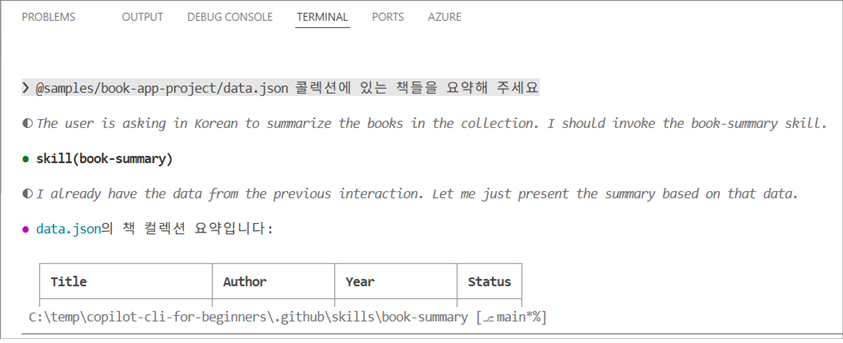

# 🧰 5: Skills 핵심 실습

> 🕒 실제 핸즈온 소요 시간: 약 20~30분

이번 실습의 핵심은 하나입니다. Copilot에게 매번 긴 프롬프트를 반복해서 설명하지 않고, 자주 쓰는 작업 규칙을 skill로 등록해 자동으로 불러오게 만드는 것입니다. 에이전트가 사고 방식과 역할을 바꾸는 도구라면, skill은 **특정 작업을 수행하는 기준**과 **체크리스트**를 붙여 주는 도구입니다.

## 🎯 이 장에서 바로 익힐 것

- Skills가 어떻게 자동으로 트리거되는지 이해하기
- `SKILL.md` 파일 형식과 저장 위치 익히기
- `/skills` 명령으로 skill 확인, reload, 정보 조회하기
- 간단한 skill 하나를 직접 만들고 자동 호출까지 테스트하기
- Skills, Agents, MCP를 언제 구분해 써야 하는지 정리하기

## 🧠 핵심 개념


Skills는 Copilot이 프롬프트를 읽고 관련성이 높다고 판단할 때 자동으로 로드하는 작업 지침입니다. 즉, 사용자는 자연어로 요청하고 Copilot은 설명에 맞는 skill을 뒤에서 선택합니다.

예를 들면 아래처럼 동작합니다.

```bash
copilot

> Check books.py against our quality checklist
> Generate tests for the BookCollection class
> Review this file for security issues
```

위 요청은 각각 `code-checklist`, `pytest-gen`, `security-audit` 같은 skill 설명과 잘 맞으면 자동 적용됩니다.

> 핵심은 skill을 매번 켜는 것이 아니라, 설명이 잘 작성되어 있으면 Copilot이 자동으로 골라 쓴다는 점입니다.


## ⚖️ Skills vs Agents vs MCP


| 도구 | 역할 | 언제 쓰면 좋은가 |
| ---- | ---- | ---- |
| Skills | 작업별 지침 자동 적용 | 코드 리뷰 기준, 테스트 규칙, 보안 점검처럼 반복 작업이 있을 때 |
| Agents | 역할과 전문성 전환 | Python 리뷰어, 테스트 전문가처럼 사고 방식 자체를 바꾸고 싶을 때 |
| MCP | 외부 데이터/서비스 연결 | GitHub, 문서, API 같은 실시간 외부 컨텍스트가 필요할 때 |

짧게 정리하면, skill은 작업 규칙, agent는 전문가 역할, MCP는 외부 연결입니다.

## ▶️ 가장 먼저 해볼 것

1. 현재 보이는 skill 확인

```bash
copilot

> /skills list
```

2. 예제 skill 구조 확인

- 이 저장소의 [.github/skills/code-checklist/SKILL.md](../.github/skills/code-checklist/SKILL.md)를 보면 기본 패턴을 바로 이해할 수 있습니다.

3. 특정 skill 정보 보기

```bash
> /skills info code-checklist
```

4. 수정 후 다시 불러오기

```bash
> /skills reload
```

## 🗂️ Skill 파일 구조


Skill은 폴더 하나와 그 안의 `SKILL.md` 파일 하나만 있으면 시작할 수 있습니다.

```text
.github/skills/
└── my-skill/
    └── SKILL.md
```

저장 위치는 두 가지입니다.

| 위치 | 범위 |
| ---- | ---- |
| `.github/skills/` | 현재 프로젝트에서 팀과 공유 |
| `~/.copilot/skills/` | 개인 환경 전체에서 재사용 |

`SKILL.md`는 YAML frontmatter와 실제 지침으로 구성됩니다.

```markdown
---
name: book-summary
description: Generate a formatted markdown summary of a book collection
---

# Book Summary

1. Output a markdown table with title, author, year, status
2. Use ✅ and ❌ for read status
3. Sort by year
4. Include totals at the bottom
```

여기서 가장 중요한 필드는 `description`입니다. Copilot이 이 설명을 보고 어떤 요청에 이 skill을 붙일지 판단하기 때문입니다. 사용자가 실제로 자주 쓰는 표현을 description에 넣는 편이 좋습니다.

## 🧪 실습

가장 짧은 실습은 `book-summary` skill 하나를 만들어 보는 것입니다.

1. skill 폴더를 만듭니다.

```bash
mkdir -p .github/skills/book-summary
cd .github/skills/book-summary
```

2. `SKILL.md`를 작성합니다.

```markdown
---
name: book-summary
description: Summarize a book collection as a markdown table with read status and totals
---

# Book Summary Generator

1. Output columns: Title, Author, Year, Status
2. Use ✅ for read and ❌ for unread
3. Sort by year ascending
4. Show total count at the bottom
5. Flag missing author or invalid year
```

3. Copilot에 다시 반영합니다.

```bash
copilot

> /skills reload
```

4. 자동 호출과 직접 호출을 둘 다 테스트합니다.

```bash
> @samples/book-app-project/data.json Summarize the books in this collection
> @samples/book-app-project/data.json 콜렉션에 있는 책들을 요약해 주세요

> /book-summary Summarize the books in this collection
> /book-summary 이 콜렉션에 있는 책들을 요약해 주세요.
```

첫 번째는 description 매칭으로 자동 트리거되는지 보는 테스트이고, 두 번째는 skill을 명시적으로 호출하는 테스트입니다.



## 🛠️ 자주 쓰는 `/skills` 명령

| 명령 | 용도 |
| ---- | ---- |
| `/skills list` | 현재 사용 가능한 skills 보기 |
| `/skills info <name>` | 특정 skill의 위치와 설명 확인 |
| `/skills reload` | 새로 만든 skill 또는 수정 내용을 다시 읽기 |
| `/skills add <name>` | 외부 skill 추가 |
| `/skills remove <name>` | skill 비활성화 또는 제거 |

## ⚠️ 자주 헷갈리는 부분

| 문제 | 원인 |
| ---- | ---- |
| skill이 자동으로 안 붙음 | `description`이 너무 추상적이거나 실제 요청 표현과 다름 |
| skill이 보이지 않음 | 폴더 위치가 다르거나 파일명이 `SKILL.md`가 아님 |
| 수정했는데 반영이 안 됨 | `/skills reload`를 안 했거나 형식 오류가 있음 |
| 기대한 출력이 안 나옴 | 지침이 모호하거나 출력 형식 규칙이 부족함 |

확인 순서는 단순합니다. 먼저 `/skills list`로 보이는지 확인하고, 그다음 `description`, 파일 위치, frontmatter를 점검하면 됩니다.

## 🔑 이 장의 핵심만 다시 정리

- Skills는 프롬프트와 description이 맞으면 자동으로 적용됩니다.
- 좋은 skill의 핵심은 긴 본문보다도 정확한 `description`입니다.
- 프로젝트용 skill은 `.github/skills/`, 개인용 skill은 `~/.copilot/skills/`에 둡니다.
- 자동 호출만 쓰지 않아도 되고, `/skill-name` 형태로 직접 호출할 수도 있습니다.
- 팀 리뷰 기준, 테스트 생성 규칙, 보안 체크리스트처럼 반복되는 작업일수록 skill 효과가 큽니다.

**[다음으로 이동하기 →](./07-mcp.md)**
