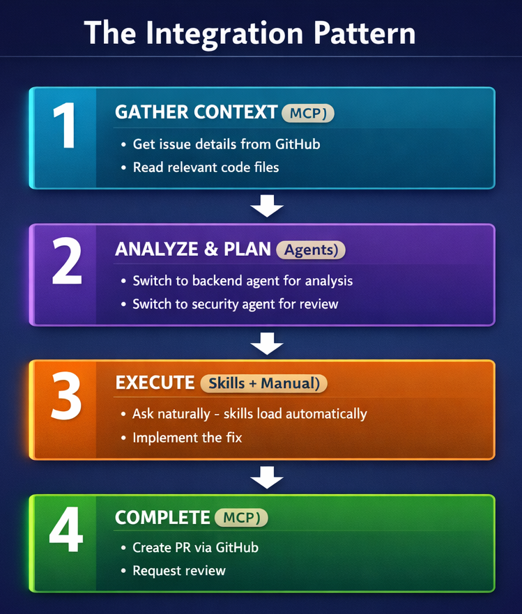

# 🎼 7: 전체 핵심 복습 

> 🕒 실제 핸즈온 소요 시간: 약 40~50분

이번 실습은 앞에서 배운 내용을 하나의 실전 흐름으로 묶는 단계입니다. 핵심은 단순합니다. 아이디어를 받고, 필요한 맥락을 모으고, 계획을 세우고, 구현하고, 테스트하고, 리뷰하고, PR까지 이어지는 흐름을 한 세션에서 다루는 것입니다.

## 이번 실습에서 다루는 내용

- agents, skills, MCP를 한 작업 안에서 조합하는 방법
- 기능 추가를 한 세션에서 끝내는 기본 패턴
- context → plan → implement → test → review 순서의 중요성
- 반복 작업을 hook이나 문서화된 워크플로로 줄이는 방법
- 과정 전체를 팀이 재사용할 수 있게 정리하는 방법

## 🧩 핵심 개념 


전체 실습의 비유는 오케스트라입니다. 각 도구는 따로도 쓸 수 있지만, 제대로 조합했을 때 효과가 커집니다.

| 요소 | 역할 |
| ---- | ---- |
| 기본 Copilot 워크플로 | 계획, 구현, 테스트, 리뷰의 중심 흐름 |
| Agents | 특정 역할에 맞춘 전문 분석 |
| Skills | 반복 작업에 대한 자동 규칙 적용 |
| MCP | GitHub, 파일, 문서 같은 외부 맥락 연결 |

핵심은 좋은 도구를 많이 쓰는 것이 아니라, 순서를 맞게 조합하는 것입니다.

## ⚡가장 중요한 패턴: 한 세션에서 끝내기 

이 장에서 가장 먼저 익혀야 할 패턴은 아래 흐름입니다.

1. 필요한 파일과 이슈 정보를 먼저 모읍니다.
1. `/plan`으로 구현 단계를 나눕니다.
1. 필요하면 agent로 설계나 테스트 관점을 보강합니다.
1. 구현 후 테스트를 추가합니다.
1. `/review`로 변경 사항을 점검합니다.
1. 마지막에 커밋 메시지나 PR 초안까지 이어갑니다.

간단한 예시는 아래와 같습니다.

```bash
copilot

> 나는 book 앱에 "list unread" 명령을 추가하려 합니다. 어떤 파일들이 변경되어야 하나요?
> /plan 'list unread' 명령을 book 앱에 추가합니다.

> /agent
# Select python-reviewer
> @samples/book-app-project/books.py get_unread_books 메서드를 설계해 주세요.

> /agent
# Select pytest-helper
> @samples/book-app-project/tests/test_books.py unread 필터링에 대해서 테스트 케이스를 설계해 주세요.

> books.py와 book_app.py에 기능을 구현합니다.
> 새로운 기능에 대한 테스트를 생성합니다.

> /review
> "Feature: Add list unread books command" 라는 제목의 PR을 생성합니다.
```

핵심은 사용자가 직접 모든 세부 구현을 손으로 옮겨 다니는 대신, 각 단계에서 적절한 도구를 호출해 흐름을 유지하는 것입니다.

## 🔗 통합 패턴 이해하기 



문제를 다룰 때는 보통 아래 네 단계로 보면 충분합니다.

| 단계 | 무엇을 하나 |
| ---- | ---- |
| Gather Context | 파일, 이슈, 커밋, 문서 같은 재료 수집 |
| Analyze and Plan | agent나 기본 기능으로 설계와 우선순위 정리 |
| Execute | 코드 수정, 테스트 작성, 문서 업데이트 |
| Complete | review, commit message, PR 생성 |

이 순서를 지키면 바로 구현부터 들어가서 다시 되돌아오는 일을 줄일 수 있습니다.

## 🛠️ 자주 쓰는 실전 워크플로 


### 1. 기능 추가 워크플로

가장 기본적인 흐름입니다.

- 파일을 열어 현재 구조를 파악합니다.
- `/plan`으로 변경 범위를 정합니다.
- 구현합니다.
- 테스트를 생성하거나 보강합니다.
- `/review` 후 PR 또는 커밋 메시지까지 만듭니다.

### 2. 버그 조사 워크플로

이슈가 있다면 먼저 이슈 내용과 관련 파일을 읽습니다. 그다음 agent로 원인을 분석하고, 테스트를 먼저 생각한 뒤 수정으로 이어가면 됩니다.

예시:

```bash
copilot

> Get the details of issue #1
> @samples/book-app-project/books.py Show me the find_by_author method

> /agent
# Select python-reviewer
> Analyze why partial author matching fails
> Implement the fix
> Generate pytest tests for partial matches and case variations
```

### 3. 새 코드베이스 온보딩 워크플로

처음 보는 프로젝트일수록 구조 설명, 특정 실행 흐름 분석, 개선 포인트 탐색, GitHub 이슈 확인을 한 세션에 모아 처리하는 것이 효율적입니다.

## 🤖 자동화는 선택이지만 효과가 큼 

반복되는 검사는 사람이 기억하지 말고 hook이나 자동화로 밀어 넣는 편이 낫습니다.

예를 들어 커밋 전에 간단한 보안 리뷰를 자동으로 실행하게 할 수 있습니다. 다만 초반에는 자동화까지 한 번에 넣기보다, 먼저 `/review`를 습관화하는 편이 현실적입니다.

## ✅ 실습 단계

아래 순서로 실습을 따라하면 핵심을 익힐 수 있습니다.

1. book app에 작은 기능 하나를 정합니다.
예: unread 목록 보기, year range 검색, CSV export

2. 관련 파일을 먼저 읽습니다.

```bash
copilot

> @samples/book-app-project/books.py @samples/book-app-project/book_app.py 
year-range 검색 기능을 추가하려면 무엇이 바뀌어야 하는지 설명해 주세요
```

3. `/plan`으로 구현 계획을 세웁니다.

```bash
> /plan search-by-year-range 명령을 book 앱에 추가하는 계획을 세워 주세요.
```

4. 필요하면 agent로 설계와 테스트 관점을 분리합니다.

```bash
> /agent
# Select python-reviewer
> find_by_year_range(start_year, end_year)을 설계해 주세요. 

> /agent
# Select pytest-helper
> year range 검색 기능에 대한 테스트 케이스를 생성해 주세요. 경계 조건(edge cases)도 포함합니다.
```

5. 구현과 테스트를 진행합니다.

```bash
> books.py 안에 find_by_year_range 구현을 추가하고, book_app.py에서 이 기능을 호출하도록 연결합니다.
> 유효하지 않은 연도, 역순 범위, 결과 없는 경우에 대한 테스트도 생성합니다.
```

6. 마지막에 review와 정리를 합니다.

```bash
> /review
> 새로운 명령에 대해서 README도 업데이트해 주세요.
> 커밋 메시지를 생성해 주세요
```

## 📌실전에서 기억할 원칙

| 원칙 | 이유 |
| ---- | ---- |
| 맥락부터 모으기 | 분석과 구현 품질이 올라감 |
| 먼저 계획 세우기 | 되돌림 비용이 줄어듦 |
| 역할이 다르면 agent 분리 | 설계와 테스트 품질이 선명해짐 |
| 리뷰를 마지막 습관으로 두기 | 버그와 보안 문제를 늦기 전에 잡음 |
| 좋은 흐름은 문서화하기 | 팀이 같은 패턴을 재사용 가능 |

짧게 말하면, 이 실습의 핵심은 새로운 기능이 아니라 작업 순서를 배우는 데 있습니다.

## 🚀 이 장의 핵심만 다시 정리

- 앞 장의 기능들은 따로 배우는 것이 아니라 함께 묶어 쓸 때 가치가 커집니다.
- 좋은 세션은 보통 context → plan → implement → test → review 순서를 따릅니다.
- agents, skills, MCP는 목적이 다르므로 한 문제를 단계별로 나눠 쓰는 편이 좋습니다.
- 자동화는 필수가 아니지만, 반복 리뷰나 검사를 줄이는 데 매우 효과적입니다.
- 결국 중요한 것은 도구 개수가 아니라 재사용 가능한 작업 패턴을 만드는 것입니다.
