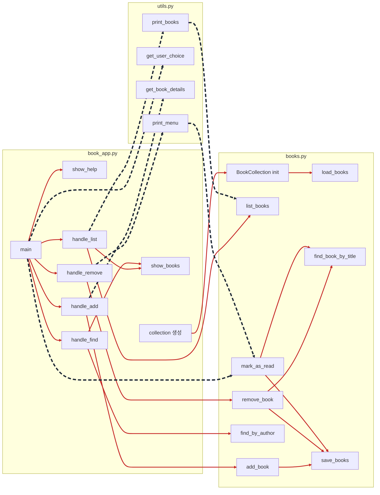

# book-app-project 구조 및 Python 파일 분석

## 프로젝트 개요

`book-app-project`는 책 정보를 관리하는 아주 작은 Python CLI 예제 프로젝트입니다.  
사용자는 명령줄에서 책 목록 조회, 추가, 삭제, 저자 검색 같은 작업을 수행할 수 있고, 데이터는 `data.json` 파일에 저장됩니다.

이 프로젝트는 다음처럼 이해하면 됩니다.

- `book_app.py`: 사용자 명령을 받는 CLI 인터페이스
- `books.py`: 실제 책 데이터를 다루는 핵심 로직
- `utils.py`: 아직 직접 연결되지 않은 보조 UI 함수 모음
- `data.json`: 책 데이터 저장 파일
- `tests/test_books.py`: 핵심 기능을 검증하는 테스트

즉, 전체 구조는 **입력/출력은 `book_app.py`, 데이터 처리와 저장은 `books.py`, 검증은 `tests/test_books.py`** 로 나뉘는 간단한 학습용 CLI 애플리케이션입니다.

---

## 전체 파일 구조와 역할

### `book_app.py`
- 프로그램의 진입점입니다.
- 사용자가 입력한 명령(`list`, `add`, `remove`, `find`, `help`)을 해석합니다.
- `BookCollection` 객체를 사용해 실제 기능을 호출합니다.
- 사용자 입력과 출력 같은 CLI 인터페이스 역할을 담당합니다.

### `books.py`
- 핵심 비즈니스 로직이 들어 있는 파일입니다.
- `Book` 데이터 모델과 `BookCollection` 클래스를 정의합니다.
- 책 목록 로드, 저장, 추가, 삭제, 검색, 읽음 표시 같은 기능을 처리합니다.
- JSON 파일(`data.json`)을 간단한 데이터 저장소처럼 사용합니다.

### `utils.py`
- 메뉴 출력, 입력 처리, 목록 출력 같은 보조 함수들이 들어 있습니다.
- 현재 메인 실행 흐름에서는 직접 사용되지 않습니다.
- 별도의 메뉴형 인터페이스를 만들 때 활용할 수 있는 유틸리티 성격의 파일입니다.

### `data.json`
- 책 데이터를 저장하는 JSON 파일입니다.
- 이 프로젝트의 간단한 데이터베이스 역할을 합니다.
- 각 책은 `title`, `author`, `year`, `read` 값을 가집니다.

### `tests/test_books.py`
- `pytest` 기반 테스트 파일입니다.
- `BookCollection`의 핵심 기능이 정상 동작하는지 검증합니다.
- 테스트 중에는 실제 `data.json` 대신 임시 파일을 사용하도록 구성되어 있습니다.
---

## 동작 흐름

이 프로젝트의 실행 흐름은 다음과 같습니다.

1. 사용자가 `python book_app.py list` 같은 명령을 실행합니다.
2. `book_app.py`의 `main()` 함수가 명령을 해석합니다.
3. 전역으로 생성된 `BookCollection` 인스턴스가 `data.json`에서 책 목록을 불러옵니다.
4. 명령에 따라 `books.py`의 메서드를 호출합니다.
5. 추가/삭제/읽음 처리 같은 변경 작업은 즉시 `data.json`에 저장됩니다.
6. 조회 결과는 콘솔에 보기 좋은 형태로 출력됩니다.

즉, `book_app.py`는 사용자와 상호작용하고, `books.py`는 데이터를 처리하는 구조입니다.

---

## 파일들 사이의 관계 및 개선 포인트

주요 파일의 관계를 먼저 요약하면 다음과 같습니다.

- `book_app.py`는 사용자 명령을 받아 실행 흐름을 제어하는 진입점입니다.
- `books.py`는 실제 데이터 처리와 저장을 담당하는 핵심 로직 계층입니다.
- `utils.py`는 입력/출력 보조 함수 모음이지만, 현재 `book_app.py`와 연결되지 않아 사실상 미사용 상태입니다.

    즉, 현재 구조는 `book_app.py -> books.py` 연결은 살아 있지만, `utils.py -> book_app.py` 연결은 빠져 있는 상태라고 볼 수 있습니다. 즉, `utils.py`에는 다양한 메서드가 준비되어 있지만 `book_app.py`에서 호출하지 않아 실행 흐름에서 빠져 있습니다. 또한, `books.py`의 `mark_as_read()`는 핵심 기능이지만 `main()`에서 해당 명령으로 연결되지 않아 현재는 사용자 입장에서 사용할 수 없습니다.

| 구분 | 현재 관계 | 개선할 부분 또는 누락된 연결 |
| --- | --- | --- |
| `book_app.py` 와 `utils.py` | 현재 직접 연결이 없음 | `book_app.py` 안에 이미 `show_books()`와 입력 처리 코드가 있어 `utils.py`와 기능이 중복됨. `utils.print_books()`와 `utils.get_book_details()`를 가져다 쓰도록 통합하거나, 반대로 `utils.py`를 제거하는 방향 중 하나로 정리 필요 |
| `utils.py` 와 `books.py` | 직접 연결은 없음 | 구조상 직접 연결이 꼭 필요한 것은 아니지만, `utils.py`는 `Book` 객체 형식을 전제로 출력 포맷을 만듦. 따라서 UI 보조 모듈로 쓰려면 `book_app.py`를 통해 간접적으로 연결되도록 정리하는 편이 자연스러움 |
| 출력 방식 | `book_app.py`의 `show_books()`와 `utils.py`의 `print_books()`가 각각 따로 존재함 | 같은 책임을 두 군데서 처리하고 있어 유지보수성이 떨어짐. 출력 형식을 한 곳으로 모아야 함 |
| 입력 처리 방식 | `book_app.py`는 `input()`을 직접 호출하고, `utils.py`도 별도 입력 함수를 가짐 | 입력 수집 로직이 중복됨. `handle_add()`는 `utils.get_book_details()`를 재사용하도록 리팩터링 가능 |
| 기능 연결 일관성 | `books.py`에는 `mark_as_read()`가 있지만 `book_app.py`에는 해당 명령이 없음 | 핵심 기능이 구현되어 있는데 CLI에서 접근할 수 없음. `mark-read` 같은 명령을 추가하거나 메뉴 기반 UI와 연결해야 함 |
| UI 방식 | `book_app.py`는 명령행 인자 기반 CLI이고, `utils.py`는 숫자 메뉴 기반 인터페이스를 가정함 | 두 파일이 서로 다른 UI 방식을 전제로 작성되어 있음. 하나의 인터페이스 전략으로 통일해야 함 |
| 메뉴 내용과 실제 기능 | `utils.py` 메뉴에는 `Mark book as read`가 있고 `Find books by author`는 없음 | 실제 `book_app.py` 기능과 메뉴 항목이 일치하지 않음. 메뉴를 사용할 계획이라면 명령 체계와 동일하게 맞춰야 함 |
| 입력 검증 | `book_app.py`와 `utils.py` 모두 빈 제목, 빈 저자, 음수/비정상 연도 같은 값 검증이 약함 | 사용자 입력 검증을 `books.py` 또는 별도 검증 함수로 모아야 함. 현재는 잘못된 데이터가 그대로 저장될 수 있음 |
| 역할 분리 | `book_app.py`는 명령 처리와 출력 포맷팅까지 함께 담당함 | CLI 제어와 화면 출력 책임이 조금 섞여 있음. 작은 프로젝트라 문제는 없지만, 확장 시에는 UI 처리와 명령 핸들링을 더 분리하는 편이 좋음 |


## 메서드 관계 Mermaid 차트

아래 차트는 `book_app.py`, `books.py`, `utils.py`가 제공하는 주요 메서드들 사이의 관계를 메서드 단위로 표현한 것입니다.

- 실선: 현재 코드에서 실제로 연결되어 있는 호출 관계
- 점선: 구현은 되어 있지만 현재 연결되지 않았거나, 연결하는 것이 자연스러운 관계




## Python 파일별 내용 정리 (참고용)

## 1. `book_app.py`

이 파일은 CLI 프로그램의 메인 진입점입니다.

### 주요 구성

#### `collection = BookCollection()`
- 프로그램 시작 시 전역으로 책 컬렉션 객체를 생성합니다.
- 이 시점에 `books.py` 내부의 `load_books()`가 호출되어 `data.json`의 기존 데이터를 읽어옵니다.

#### `show_books(books)`
- 책 목록을 콘솔에 보기 좋게 출력합니다.
- 책이 없으면 `No books found.`를 출력합니다.
- 각 책은 번호, 읽음 상태, 제목, 저자, 출판연도로 표시됩니다.

예시 출력 형식:

```text
1. [✓] 1984 by George Orwell (1949)
2. [ ] Dune by Frank Herbert (1965)
```

#### `handle_list()`
- 전체 책 목록을 조회합니다.
- 내부적으로 `collection.list_books()`를 호출한 뒤 `show_books()`로 출력합니다.

#### `handle_add()`
- 사용자에게 제목, 저자, 출판연도를 입력받습니다.
- 연도가 비어 있으면 `0`으로 처리합니다.
- `collection.add_book()`을 호출해 새 책을 저장합니다.
- 입력이 잘못되면 `ValueError`를 처리해서 오류 메시지를 출력합니다.

#### `handle_remove()`
- 사용자에게 삭제할 책 제목을 입력받습니다.
- `collection.remove_book(title)`을 호출합니다.
- 성공 여부와 상관없이 `Book removed if it existed.`를 출력합니다.

#### `handle_find()`
- 저자 이름을 입력받아 해당 저자의 책을 검색합니다.
- `collection.find_by_author(author)`를 호출합니다.
- 결과는 `show_books()`로 출력합니다.

#### `show_help()`
- 지원하는 명령 목록을 안내합니다.

#### `main()`
- `sys.argv`를 통해 명령줄 인자를 읽습니다.
- 명령에 따라 적절한 핸들러를 호출합니다.
- 알 수 없는 명령이 들어오면 도움말을 보여줍니다.

### 역할 요약
- 사용자 명령 해석
- 입력/출력 처리
- `BookCollection` 기능 호출

### 특징
- 구조가 단순해서 초보자가 이해하기 쉽습니다.
- `mark_as_read()` 기능은 `books.py`에 구현되어 있지만 현재 CLI 명령에는 연결되어 있지 않습니다.

---

## 2. `books.py`

이 파일은 프로젝트의 핵심 로직을 담당합니다.

### 주요 구성

#### `DATA_FILE = "data.json"`
- 책 데이터를 저장할 기본 파일 경로입니다.

#### `@dataclass class Book`
- 책 한 권의 데이터를 표현하는 모델입니다.
- 필드는 다음과 같습니다.
	- `title`: 책 제목
	- `author`: 저자
	- `year`: 출판연도
	- `read`: 읽음 여부 (`False` 기본값)

이 클래스는 데이터 저장용 구조체 역할을 합니다.

#### `class BookCollection`
- 여러 권의 책을 관리하는 클래스입니다.
- 내부적으로 `self.books` 리스트에 `Book` 객체들을 저장합니다.

### 메서드별 정리

#### `__init__(self)`
- 빈 리스트를 만든 뒤 `load_books()`를 호출합니다.
- 프로그램 시작과 동시에 저장된 책 목록을 메모리로 불러옵니다.

#### `load_books(self)`
- `data.json` 파일을 읽어 책 목록을 로드합니다.
- 파일이 없으면 빈 리스트로 시작합니다.
- JSON이 깨졌으면 경고를 출력하고 빈 리스트로 초기화합니다.

#### `save_books(self)`
- 현재 `self.books` 상태를 `data.json`에 저장합니다.
- `asdict()`를 사용해 `Book` 객체를 JSON으로 직렬화 가능한 딕셔너리로 변환합니다.

#### `add_book(self, title, author, year)`
- 새 `Book` 객체를 생성합니다.
- 리스트에 추가한 뒤 즉시 저장합니다.
- 생성된 책 객체를 반환합니다.

#### `list_books(self)`
- 현재 책 목록 전체를 반환합니다.

#### `find_book_by_title(self, title)`
- 제목을 기준으로 책 한 권을 찾습니다.
- 대소문자를 구분하지 않고 비교합니다.
- 찾으면 `Book`, 없으면 `None`을 반환합니다.

#### `mark_as_read(self, title)`
- 제목으로 책을 찾아 읽음 상태를 `True`로 바꿉니다.
- 변경 후 즉시 저장합니다.
- 성공하면 `True`, 실패하면 `False`를 반환합니다.

#### `remove_book(self, title)`
- 제목으로 책을 찾아 리스트에서 제거합니다.
- 제거 후 즉시 저장합니다.
- 성공하면 `True`, 실패하면 `False`를 반환합니다.

#### `find_by_author(self, author)`
- 저자 이름이 일치하는 책들을 모두 찾아 리스트로 반환합니다.
- 역시 대소문자를 구분하지 않고 비교합니다.

### 역할 요약
- 데이터 모델 정의
- 파일 로드/저장
- 책 추가/삭제/검색/상태 변경

### 특징
- 모델과 저장소 로직이 한 파일에 함께 들어 있습니다.
- 프로젝트가 작아서 단순하지만, 규모가 커지면 모델/저장 로직/서비스 로직을 분리할 수 있습니다.

---

## 3. `utils.py`

이 파일은 콘솔 UI를 돕는 보조 함수 모음입니다.

### 주요 함수

#### `print_menu()`
- 숫자 기반 메뉴를 출력합니다.
- 이모지를 포함한 간단한 텍스트 메뉴를 보여줍니다.

#### `get_user_choice()`
- 사용자에게 메뉴 번호를 입력받아 문자열로 반환합니다.

#### `get_book_details()`
- 제목, 저자, 출판연도를 입력받습니다.
- 연도는 정수로 변환하고, 실패하면 `0`으로 처리합니다.

#### `print_books(books)`
- 책 목록을 사람이 읽기 쉬운 형태로 출력합니다.
- 읽음 상태를 `✅ Read`, `📖 Unread`처럼 표시합니다.

### 역할 요약
- 사용자 인터페이스 보조 기능
- 입력 처리
- 출력 포맷팅

### 특징
- 현재 `book_app.py`에서는 이 함수를 사용하지 않습니다.
- 즉, 이 파일은 아직 메인 흐름과 연결되지 않은 상태입니다.
- 향후 메뉴 기반 인터페이스로 바꾸거나 리팩터링할 때 유용할 수 있습니다.

---

## 보조 파일 정리

### `data.json`
- 현재 샘플 데이터가 들어 있습니다.
- 예를 들어 `The Hobbit`, `1984`, `Dune` 같은 책 정보가 저장되어 있습니다.
- 일부 데이터는 `author`가 비어 있거나 `year`가 0인 값도 있어서, 입력 검증이 약하다는 README 설명과 연결됩니다.

### `pyproject.toml`
- 프로젝트 이름은 `book-app`입니다.
- Python 3.10 이상을 요구합니다.
- 의존성은 `pytest` 하나만 선언되어 있습니다.

